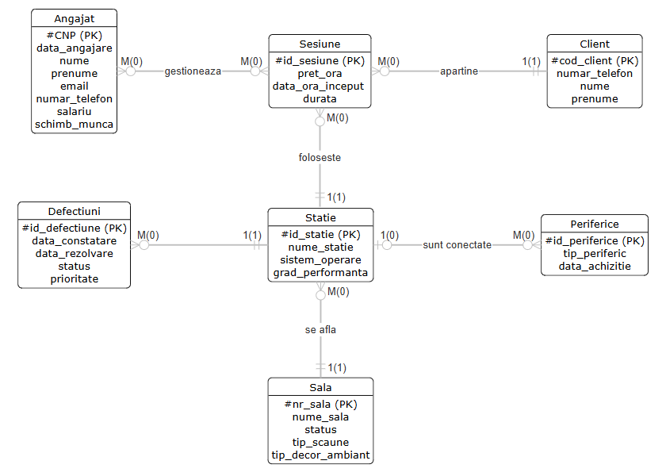
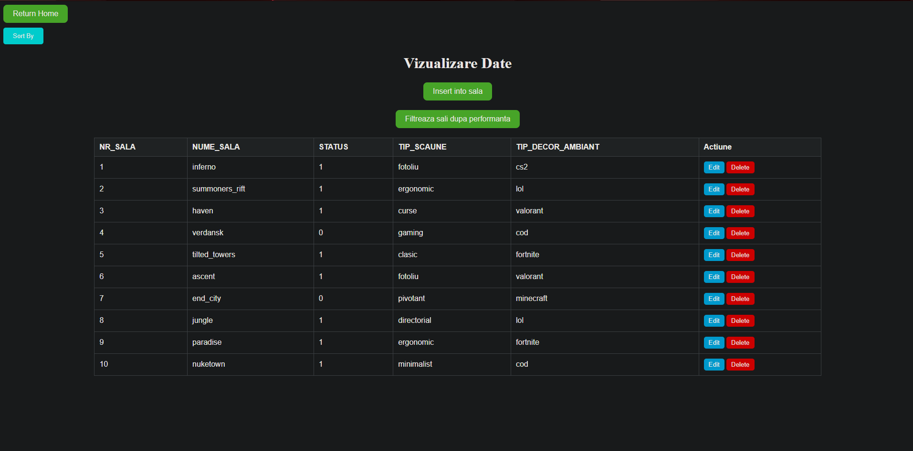
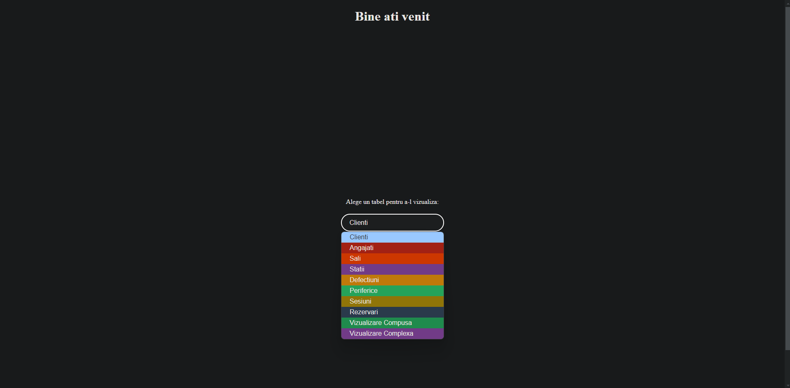
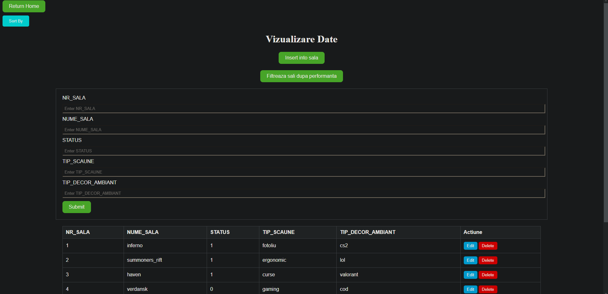

# Internet Cafe DataBase

Internet Cafe Database is a project I designed in Oracle Database to manage a small internet cafe business. Interaction with this database is enabled through a GUI I developed using Flask.

It allows users to perform simple operations, such as viewing, sorting, deleting, and editing rows. It also provides options for specific tasks, such as viewing data from multiple tables or interacting with database views.

# **Setting Up and Running the Application**

To run and test the application, follow these steps:

## **1. Install Oracle Database Express Edition**
- Download and install [Oracle Database Express Edition (XE)](https://www.oracle.com/in/database/technologies/xe-downloads.html) on your system.
- Set up the database instance and ensure it is running.

## **2. Set Up the Database**
- Copy the database schema and initial data from the [`data.sql`](data.sql) file provided in the repository.
- Execute the SQL script using Oracle SQL Developer or any preferred tool to populate the database.

## **3. Configure the Application**
- Open the `config.py` file and ensure the database connection credentials (username, password, hostname, and port) match your local Oracle Database setup.

## **4. Run the Application**
- Start the Flask application by running the following command in your terminal:
  ```bash
  python main.py








